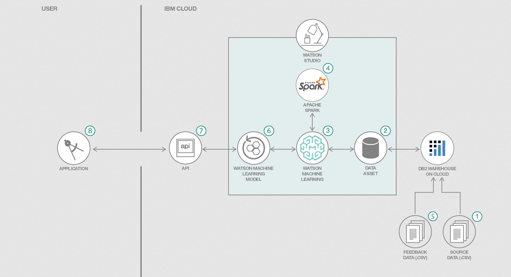

# Continuous Learning with WML and IBM DB2 Warehouse on Cloud

In this code pattern, we will use IBM Watson Machine Learning and Watson Studio, whih allows data scientists and analysts to quickly build and prototype models, to monitor deployments, and to learn over time as more data become available. Performance Monitoring and Continuous Learning enable machine learning models to retrain on new data supplied by the user or another data source. Then, all of your applications and analysis tools which depend on the model are automatically updated as Watson Studio handles selecting and deploying the best model.

In this code pattern, we’ll solve a problem for the City of Chicago using the Model Builder to model building violations. We’ll predict which buildings are most likely to fail buildings inspections. Then, we can intelligently rank the buildings by their likelihood to fail an inspection, saving time and resources for the City and for our inspectors. We’ll start building a model on publicly available data from 2017, starting in September before we introduce October, November, and December data to simulate learning over time.

When the reader has completed this Code Pattern, they will understand how to:

* Use Watson Studio to create a project and associate services
* Use IBM Machine learning service to take advantage of machine learning models management (continuous learning system) and deployment (online, batch, streaming)
* Use Apache Spark-as-a-service cluster computing framework optimized for extremely fast and large scale data processing.
* Create and deploy self learning Watson Machine learning models

## Flow

1. Input Source Data is loaded into the IBM DB2 warehouse on the cloud.
2. The source data is then added as data asset into Watson Studio.
3. The Watson Machine Learning service uses the source data and computes the evaluation using Apache Spark-as-a-service to create a machine learning model and saves the evaluation back to the warehouse.
4. Apache Spark-as-a-service to compute the evaluation.
5. Feedback data is uploaded to Watson machine learning service to continuously learn and evaluate the new data.
6. Once the evaluation is done the Watson Machine Learning service creates a machine learning model.
7. The model data is exposed through an API.
8. Application can use the API to evaluate new data and create new model based on continuous learning

## Included components

* [Watson Machine Learning](https://www.ibm.com/cloud/machine-learning): Use trusted data to put machine learning and deep learning models into production. Leverage an automated, collaborative workflow to grow intelligent business applications easily and with more confidencelaborate on building conversational AI solution.
* [Apache Spark](https://www.ibm.com/cloud/spark): Apache Spark is an open source cluster computing framework optimized for extremely fast and large scale data processing, which you can access via the newly integrated notebook interface IBM Analytics for Apache Spark.
* [IBM DB2 Warehouse](https://www.ibm.com/us-en/marketplace/db2-warehouse): IBM Db2 Warehouse is a software-defined data warehouse for private and virtual clouds that support Docker container technology. It is client managed and optimized for fast and flexible deployment with automated scaling to meet agile analytic workloads.
* [Watson Studio](https://www.ibm.com/cloud/watson-studio): IBM Watson Studio provides tools for data scientists, application developers and subject matter experts to collaboratively and easily work with data to build and train models at scale. It gives you the flexibility to build models where your data resides and deploy anywhere in a hybrid environment so you can operationalize data science faster.

## Featured technologies

* [Artificial Intelligence](https://medium.com/ibm-data-science-experience): Artificial intelligence can be applied to disparate solution spaces to deliver disruptive technologies.
* [Machine Learning](https://en.wikipedia.org/wiki/Machine_learning): Machine learning is a field of artificial intelligence that uses statistical techniques to give computer systems the ability to "learn" (e.g., progressively improve performance on a specific task) from data, without being explicitly programmed
* [DB2 Warehouse](https://www.ibm.com/us-en/marketplace/db2-warehouse): IBM Db2 Warehouse is a software-defined data warehouse for private and virtual clouds that support Docker container technology. It is client managed and optimized for fast and flexible deployment with automated scaling to meet agile analytic workloads.
* [Continuous Learning](https://en.wikipedia.org/wiki/Incremental_learning): Continuous learning is a method of machine learning, in which input data is continuously used to extend the existing model's knowledge i.e. to further train the model.

# Watch the Video

# Steps

The setup is done in 3 primary steps.  You will download the code, setup the application and then deploy the code to IBM Cloud.  If you would like to run the code locally, there will be one more step to configure the credentials locally.

1. [Clone the repo](#1-clone-the-repo)
2. [Create Watson Studio Project](#2-create-watson-studio-project)
3. [Add and Refine data asset into Watson Studio](#3-add-and-refine-data-asset-into-watson-studio)
3. [Create DB2 warehouse on cloud and add the connection to Watson Studio](#3-create-db2-warehouse-on-cloud-and-add-the-connection-to-watson-studio)
4. [Create Apache Spark as a service with IBM Cloud](#4-create-apache-spark-as-a-service-with-ibm-cloud)
5. [Create Watson Machine Learning with IBM Cloud](#4-create-watson-machine-learning-with-ibm-cloud)
6. [Add new Watson Machine Learning Model to Watson Studio](#6-add-new-watson-machine-learning-model-to-watson-studio)
7. [Add Feedback data and new evaluations to the continuiously learning model](#7-add-feedbasck-data-and-new-evaluatioins-to-the-continuiously-learning-model)
8. [Deploy the model to expose an API](#8-deploy-the-model-to-expose-an-api)
9. [Test the model](#9-test-the-model)
