# Continuous Learning with Watson Machine Learning and IBM Db2 Warehouse on Cloud

In this code pattern, we will use IBM Watson Machine Learning and Watson Studio &mdash; which allows data scientists and analysts to quickly build and prototype models &mdash; to monitor deployments, and to learn over time as more data becomes available. Performance Monitoring and Continuous Learning enables machine learning models to re-train on new data supplied by the user or other data sources. All applications and analysis tools that depend on the model are automatically updated as Watson Studio handles the selection and deployment of the best model.

In this code pattern, we’ll solve a problem for the City of Chicago using the Model Builder to model building violations. We’ll predict which buildings are most likely to fail an inspection, and we'll intelligently rank buildings by their likelihood to fail an inspection, saving time and resources for the city and building inspectors. We’ll begin by building a model on publicly available data from 2017, starting in September. Then, we will introduce data from October, November, and December data to simulate learning and model re-training over time.

When the reader has completed this Code Pattern, they will understand how to:
* Use Watson Studio to create a project and associate services
* Use IBM Machine learning service to take advantage of machine learning models management (continuous learning system) and deployment (online, batch, streaming)
* Use Apache Spark-as-a-service cluster computing framework optimized for extremely fast and large scale data processing.
* Create and deploy self learning Watson Machine learning models

## Flow


1. Initial source data is loaded into IBM Db2 Warehouse on Cloud database.
2. The source data is then loaded, as a data asset, into Watson Studio.
3. The Watson Machine Learning service uses the source data and computes an evaluation using Apache Spark-as-a-service to create a machine learning model, and saves the evaluation information back to the Db2 Warehouse on Cloud database.
4. Apache Spark-as-a-service to compute the evaluation.
5. Feedback data is uploaded to the feedback table in the Db2 Warehouse on Cloud database.
6. Once the evaluation is done the Watson Machine Learning service creates a machine learning model.
7. The model data is exposed through an API.
8. Applications can use the API to evaluate new data and create a new model based on continuous learning.


## Included components

* [Watson Machine Learning](https://www.ibm.com/cloud/machine-learning): Use trusted data to put machine learning and deep learning models into production. Leverage an automated, collaborative workflow to grow intelligent business applications easily and with more confidencelaborate on building conversational AI solution.
* [Apache Spark](https://www.ibm.com/cloud/spark): Apache Spark is an open source cluster computing framework optimized for extremely fast and large scale data processing, which you can access via the newly integrated notebook interface IBM Analytics for Apache Spark.
* [IBM Db2 Warehouse on Cloud](https://www.ibm.com/cloud/db2-warehouse-on-cloud): IBM Db2 Warehouse on Cloud is an elastic, fully managed cloud data warehouse service that's powered by IBM BLU Acceleration® technology for increased performance and optimization of analytics at a massive scale.
* [Watson Studio](https://www.ibm.com/cloud/watson-studio): IBM Watson Studio provides tools for data scientists, application developers and subject matter experts to collaboratively and easily work with data to build and train models at scale. It gives you the flexibility to build models where your data resides and deploy anywhere in a hybrid environment so you can operationalize data science faster.

## Featured technologies

* [Artificial Intelligence](https://medium.com/ibm-data-science-experience): Artificial intelligence can be applied to disparate solution spaces to deliver disruptive technologies.
* [Machine Learning](https://en.wikipedia.org/wiki/Machine_learning): Machine learning is a field of artificial intelligence that uses statistical techniques to give computer systems the ability to "learn" (e.g., progressively improve performance on a specific task) from data, without being explicitly programmed
* [IBM Db2 Warehouse on Cloud](https://www.ibm.com/cloud/db2-warehouse-on-cloud): IBM Db2 Warehouse on Cloud is an elastic, fully managed cloud data warehouse service that's powered by IBM BLU Acceleration technology for increased performance and optimization of analytics at a massive scale.
* [Continuous Learning](https://en.wikipedia.org/wiki/Incremental_learning): Continuous learning is a method of machine learning, in which input data is continuously used to extend the existing model's knowledge i.e. to further train the model.

# Watch the Video

[](https://youtu.be/sIEcqyyOtUk)


# Steps

1. [Clone the repo](#1-clone-the-repo)
2. [Create Watson Studio Project](#2-create-watson-studio-project)
3. [Create Db2 Warehouse on Cloud database and add the connection to Watson Studio](#3-create-db2-warehouse-on-cloud-database-and-add-the-connection-to-watson-studio)
4. [Create and load data into Db2 Warehouse on Cloud database](#4-create-and-load-data-into-db2-warehouse-on-cloud-database)
5. [Add connected asset into Watson Studio](#5-add-connected-asset-into-watson-studio)
6. [Create Apache Spark as a service with IBM Cloud](#6-create-apache-spark-as-a-service-with-ibm-cloud)
7. [Create Watson Machine Learning with IBM Cloud](#7-create-watson-machine-learning-with-ibm-cloud)
8. [Add new Watson Machine Learning Model to Watson Studio](#8-add-new-watson-machine-learning-model-to-watson-studio)
9. [Add Feedback data and new evaluations to the continuously learning model](#9-add-feedback-data-and-new-evaluations-to-the-continuously-learning-model)
10. [Deploy the model to expose it through an API](#10-deploy-the-model-to-expose-it-through-an-api)
11. [Test the model](#11-test-the-model)


### 1. Clone the repo

Clone the `continuous-learning-with-watson-ml-and-db2` locally. In a terminal, run:

```
$ git clone https://github.com/IBM/continuous-learning-with-watson-ml-and-db2
$ cd continuous-learning-with-watson-ml-and-db2
```

### 2. Create Watson Studio Project

If you do not already have an IBM Cloud account, [sign up for IBM Cloud](https://console.bluemix.net/registration) and login to your IBM cloud account.

First you will need to create an `Object Storage` service if you don't already have one. From the catalog, search for `object storage`, select `Object Storage` service, choose the `lite` plan and click `create`.


Go back to catalog, search for `Watson Studio`, select it, choose the `lite` plan and click `create`.


Create a new Project by clicking the `New Project` link, choose `Complete`, give it a name and click create.


### 3. Create Db2 Warehouse on Cloud database and add the connection to Watson Studio

From the IBM Cloud catalog search for `Db2 Warehouse on Cloud` and create one using the appropriate plan.


Once the service is created, create new credentials by selecting `Service Credentials` option in the left navigation panel. Make sure to save the credentials for upcoming steps.


From Watson Studio project that you have created earlier, go to `+ Add to Project` and choose `Connection` 
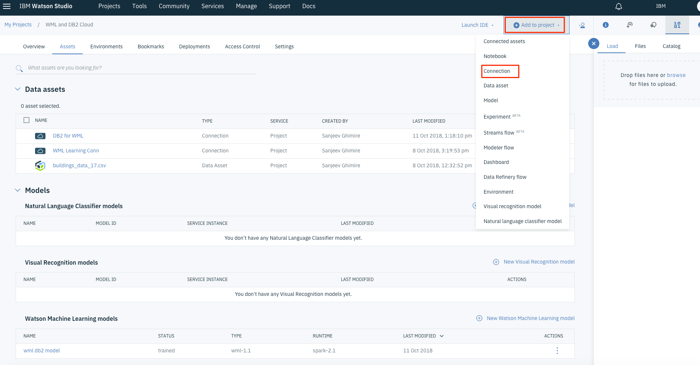

Select `Db2 Warehouse` from the available options to connect to Db2 Warehouse on Cloud database you created earlier.
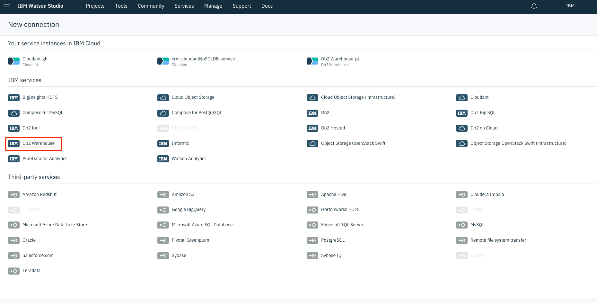

Configure the connection based on the Db2 credentials you saved earlier.


### 4. Create and load data into Db2 Warehouse on Cloud database

From the IBM Db2 warehouse service page, click `Manage` and  click `Open` to go to `IBM Db2 Warehouse on Cloud` console.
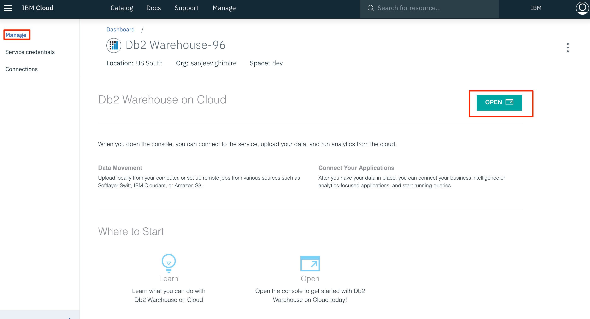

Open the hamburger menu and select `RUN SQL` to open up a SQL editor.
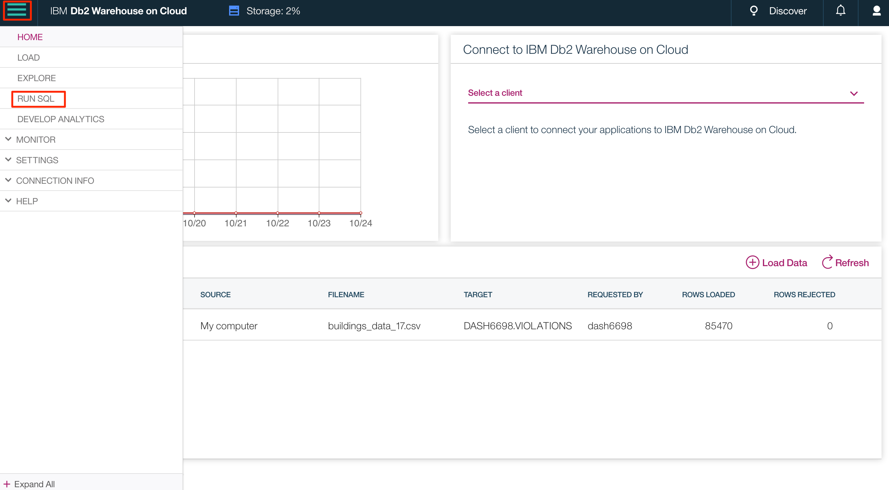

In the sql editor, copy the SQL statement from the  file and click `Run All` option from the `RUN` drop down list at the top right.
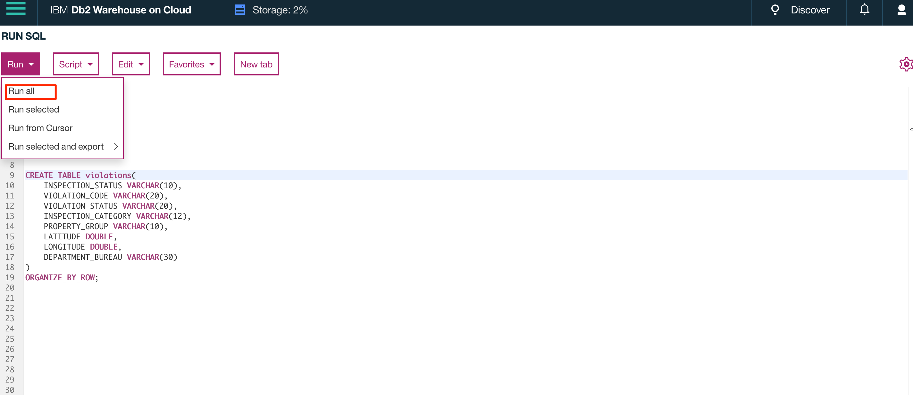

Similarly, copy the SQL statement from the  file into the SQL editor and click `Run All` option from the `RUN` drop down list at the top right.
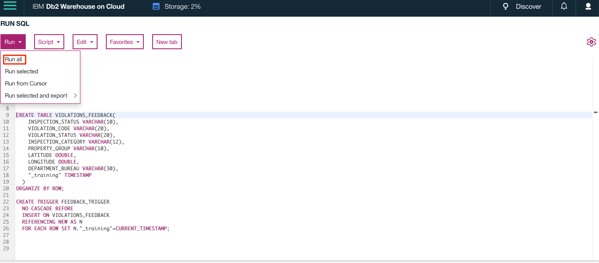

> Note that `"_training"` column should be lower case in the create statement and in the trigger.

Next we will be loading the `violations` table from a CSV file. Click `LOAD` from the hamburger menu, which will bring you to a page where you can upload `.csv` file.


Browse the  from your project directory that you cloned earlier and click `Next`.
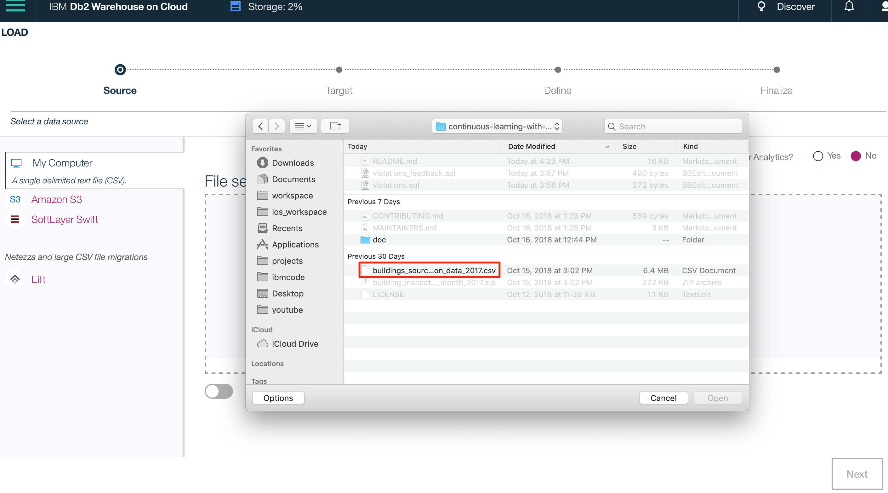

Choose the correct `Schema`, table `VIOLATIONS` and click `Next`.
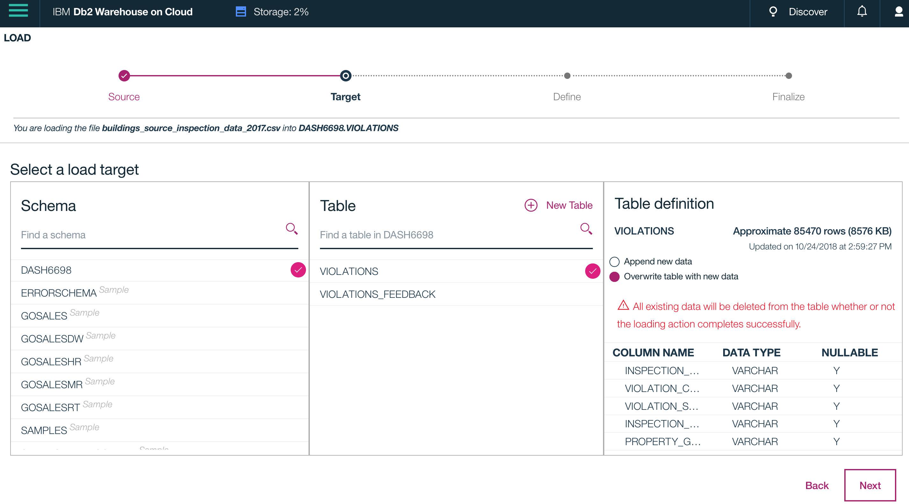

Click `Next` on the next screen and click `Begin Load` to load the source data from the `CSV` file to the `VIOLATIONS` table.


### 5. Add connected asset into Watson Studio

In Watson Studio, go to your project and select the `+ Add to Project` and select `Connected assets` option from the dropdown list.

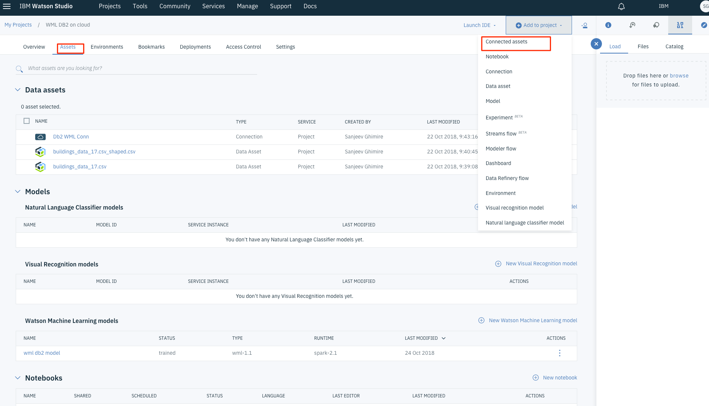

Provide a name, and click `Select source`

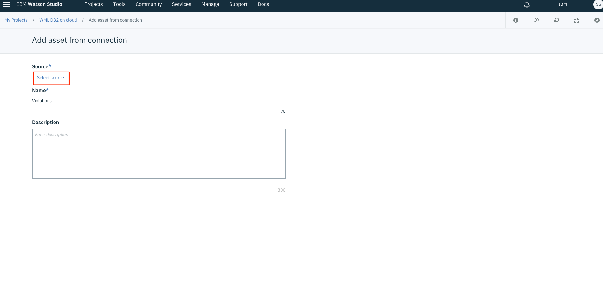

Choose the Db2 `database` and the `table` that you created in the previous step. Click `Create`.
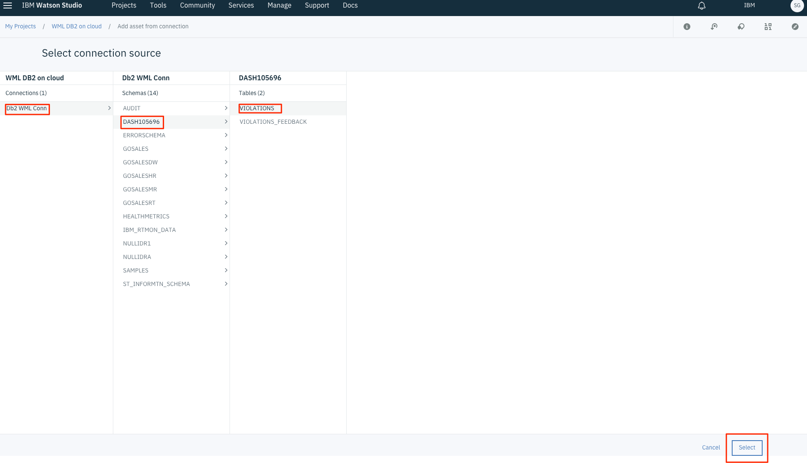

In the next screen, click `Create` to create the connected asset which will be used during creating of Watson machine learning model.
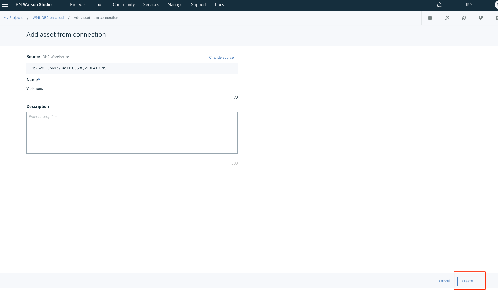


### 6. Create Apache Spark as a service with IBM Cloud

From the catalog in IBM Cloud, search for keyword `spark` and choose `Apache Spark` service.


Create the service using `lite` plan.
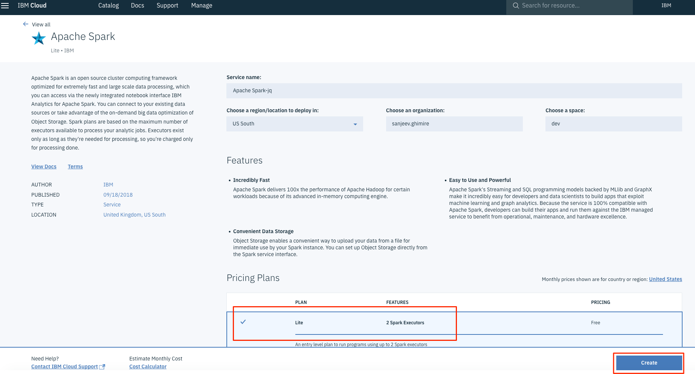

Once created, we need to add this service to Watson Studio. Go to your  Watson studio project, select `settings` and from the `+ Add Service` dropdown list, select `spark` and add the existing spark service that you have just created.
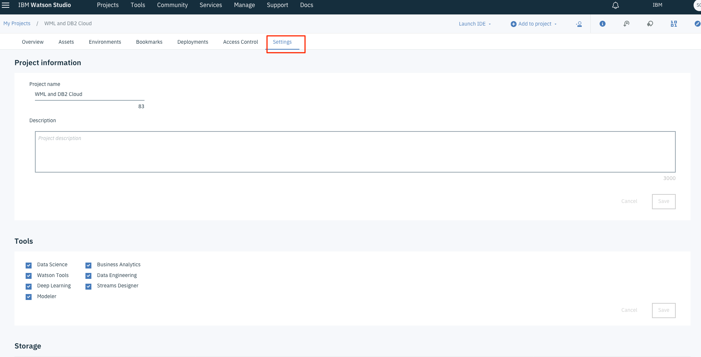


### 7. Create Watson Machine Learning with IBM Cloud
From the catalog in IBM Cloud, search for keyword `machine learning` and choose `IBM Machine Learning` service.


Create the service using `lite` plan.


Similar to the previous Step 5, Add the machine learning service you just created to your Watson Studio project.

### 8. Add new Watson Machine Learning Model to Watson Studio

From the `Assets` tab of your Watson Studio project, select `+ New Watson Machine Learning Model`


Provide a name, choose the `Machine Learning` and `Apache Spark` instance that you added to your project, choose `Model Builder` for model typ, choose `Manual` so that you can prepare your own data and click `Create`.


Select the `data asset` that you created earlier from the options.
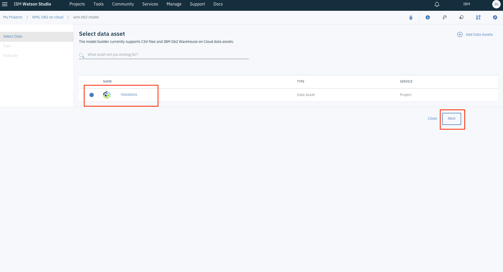

Once the data is loaded, choose the `INSPECTION_STATUS` as the column to predict for new set of data and `All` for feature columns. We will be using `Binary Classification`. Add Estiimators by clicking the `+ Add Estimators` link, and in our case we will be using `Logistic Regression` and `Decision Tree Classifier`. You can select others as well based on what kind of estimator algorithm you want to choose.


Once the training and evaluation is done, you can choose the one that performed the best and then click `Save`.


### 9. Add Feedback data and new evaluations to the continuously learning model

Once the Watson Machine Learning Model is saved, select the `Evaluation` tab. First we need to configure the performance monitoring. 

* Select the `Configure Performance Monitoring` link
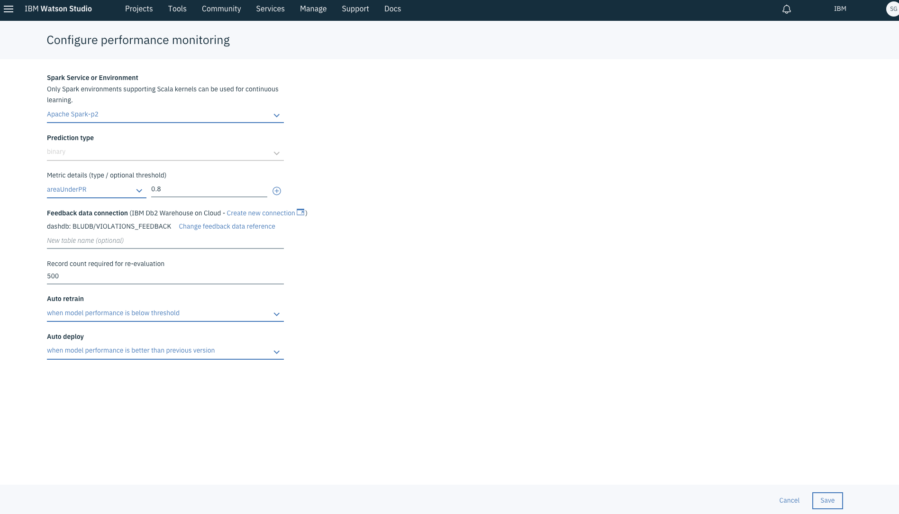

* Add the spark service from the dropdown list. It's the one that you added to your Watson studio project.
* Choose `areaUnderPR` (performance metric of the model) and select the threshold as 0.8. This means if the performance is under 0.8, the model needs to be re-trained using all the source data and new data and hence continuous learning.
* Use `500` as record count and click `Save`.
* For `Auto Retrain` select  `when model performance is below threshold`
* For `Auto Deploy` select `when performance is better than previous model`
* Add the connection by selecting `Select Feedback Reference Data` and select the Db2 connection that you previously created.


* Once thats done, now you can add data using `+ Feedback Data`


* Once the feedback data is loaded, select `New Evaluation` to evaluate the uploaded feedback data. You can unzip the provided data [Chicago building inspection data by month 2017](building_inspection_data_by_month_2017.zip) in the repo and use that monthly inspection data as feedback data.
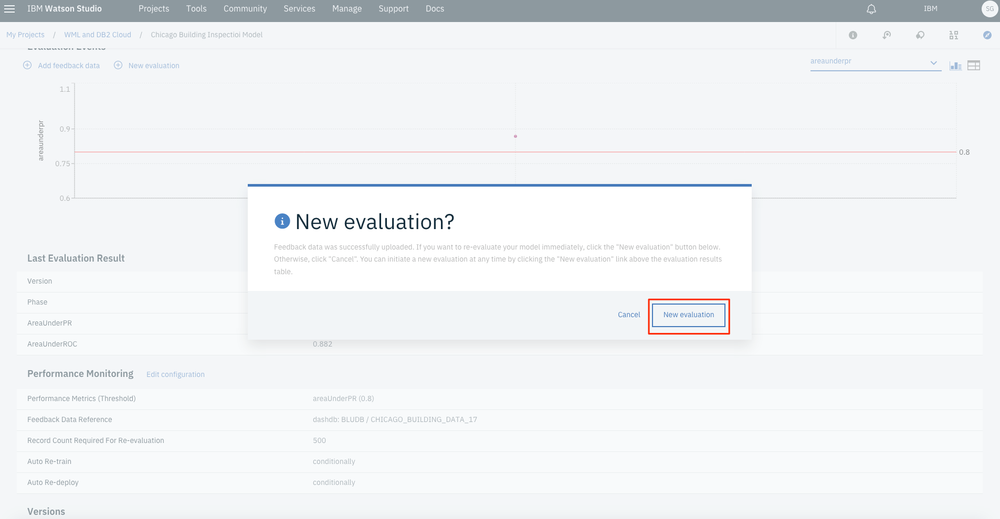

* When the evaluation is completed we can see where the threshold value lies for this new feedback data. Diagram below shows that the performance exceeds the threshold value and hence the new version of the model is automatically deployed.


* You can also see the list of evaluations that have been completed and see how the model has been continuously learning
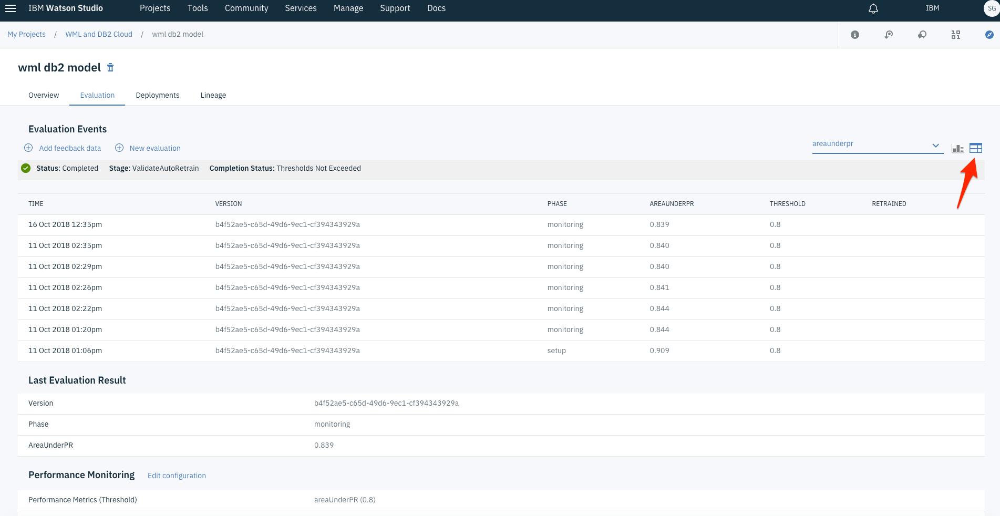
* You can upload new feedback data repeatedly from the provided data [Chicago building inspection data by month 2017](building_inspection_data_by_month_2017.zip) so that the model continuously learns.

### 10. Deploy the model to expose it through an API

* Select the model, and then select `Deployments` tab. Click `+ Add Deployment` to add a new deployment,
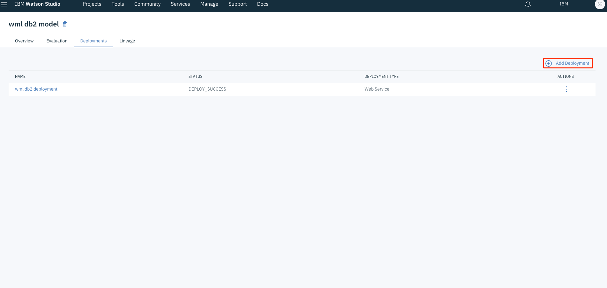
* Provide a name and choose `Web Service` as deployment type.
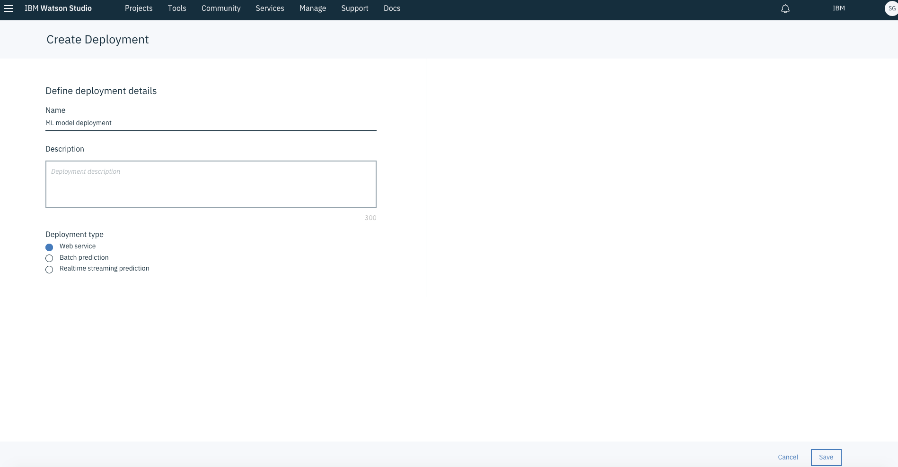
* Now the model is exposed through and API. If you select `Implementation` tab you can see different examples on how to use the newly created API.
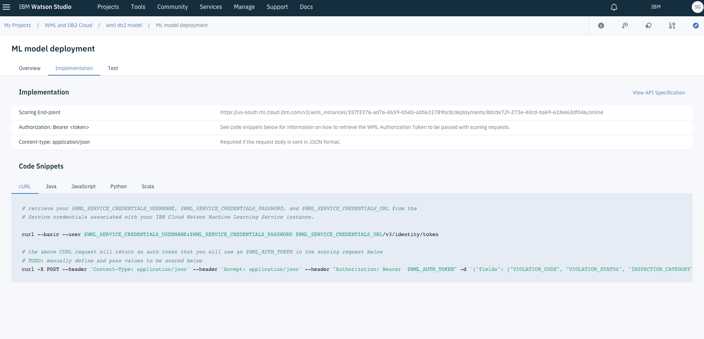

### 11. Test the model

You can access and test the API programmatically, or use curl commands. You can also go to the `Test` tab and provide a new set of data to evaluate the inspection status.


The result of the evaluation is shown in a horizontal graph located on the right side of the page.

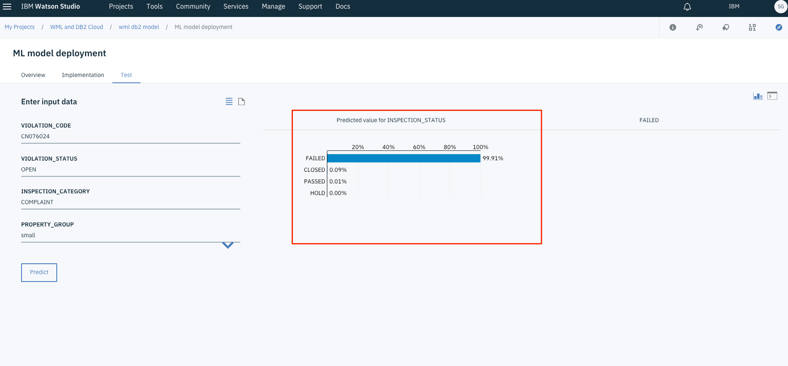

## Troubleshooting

If the evaluation gives an error as shown below, you need to upgrade the `Machine Learning` service instance to the `Standard`.
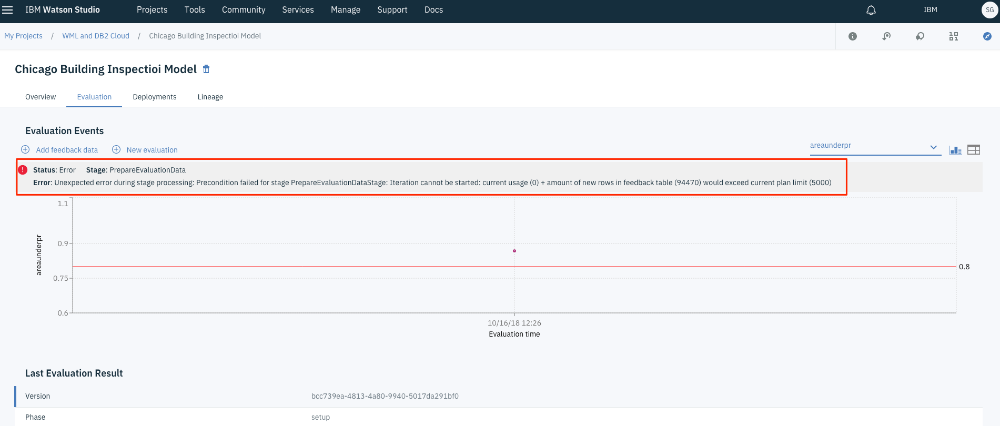


## Links

* [IBM Watson Studio](https://dataplatform.cloud.ibm.com/docs/content/getting-started/welcome-main.html) documentation
* [IBM Secure Gateway](https://console.bluemix.net/docs/services/SecureGateway/index.html) documentation
* [Docker](https://docs.docker.com/) documentation
* [Db2 Warehouse on Cloud](https://www.ibm.com/support/knowledgecenter/en/SS6NHC/com.ibm.swg.im.dashdb.kc.doc/welcome.html) documentation
* Related code pattern: [Continuous learning on Db2](https://github.com/IBM/watson-continuous-learning-on-db2)
* Related video: [Continuous Learning on Watson Data Platform](https://www.youtube.com/watch?v=HCVxGMd1RiQ)

## Learn more

* **Artificial Intelligence Code Patterns**: Enjoyed this Code Pattern? Check out our other [AI Code Patterns](https://developer.ibm.com/code/technologies/artificial-intelligence/).
* **AI and Data Code Pattern Playlist**: Bookmark our [playlist](https://www.youtube.com/playlist?list=PLzUbsvIyrNfknNewObx5N7uGZ5FKH0Fde) with all of our Code Pattern videos
* **With Watson**: Want to take your Watson app to the next level? Looking to utilize Watson Brand assets? [Join the With Watson program](https://www.ibm.com/watson/with-watson/) to leverage exclusive brand, marketing, and tech resources to amplify and accelerate your Watson embedded commercial solution.

## License

This code pattern is licensed under the Apache Software License, Version 2. Separate third party code objects invoked within this code pattern are licensed by their respective providers pursuant to their own separate licenses. Contributions are subject to the Developer [Certificate of Origin, Version 1.1 (“DCO”)] (https://developercertificate.org/) and the [Apache Software License, Version 2]( (http://www.apache.org/licenses/LICENSE-2.0.txt).

ASL FAQ link: http://www.apache.org/foundation/license-faq.html#WhatDoesItMEAN


